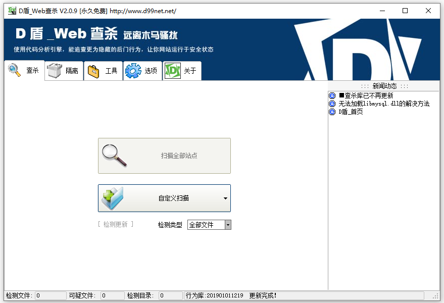
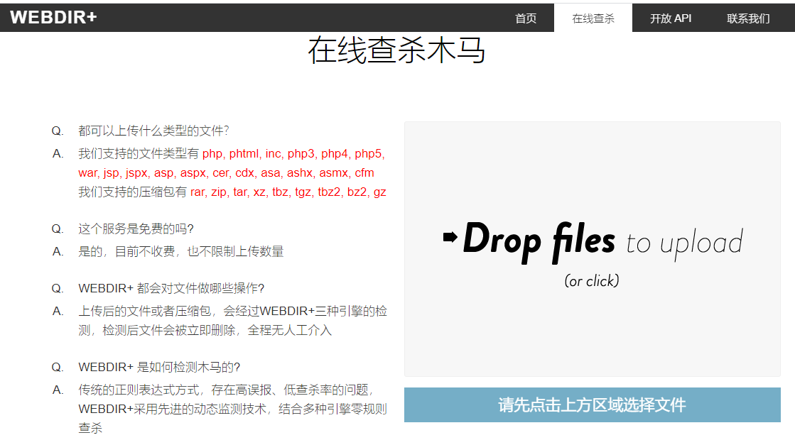
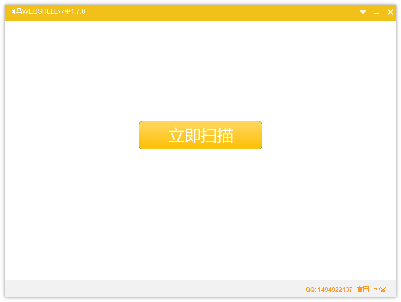
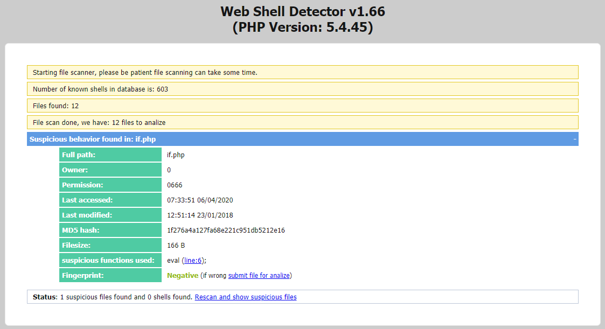
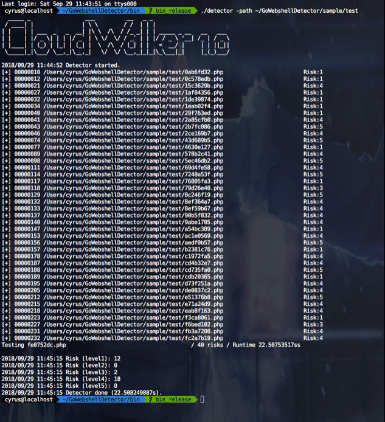
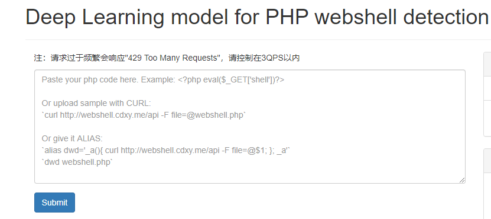
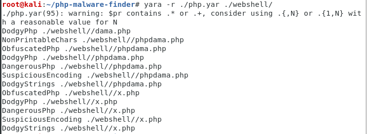
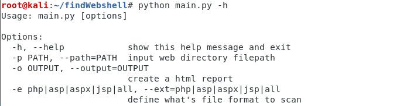
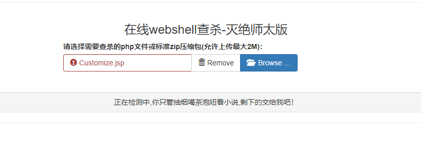

# 第3篇：常见的Webshell查杀工具

����վ������������ʱ��������Ҫһ��Webshell��⹤�ߣ����������Ƿ���webshell����һ���Ų�ϵͳ���ܴ��ڵİ�ȫ©����

�����Ƽ���10��Webshll��⹤�ߣ�������վ�����Ų顣��Ȼ��Ŀǰ�г��ϵĺܶ�������ȫ��ƷҲ���ṩ����WebShell������������簢���ơ������ơ�safedog�ȣ������ݲ����ۡ�

**1��D��\_Web��ɱ**

��D��Ʒ��ʹ�������з�������չ���Ĵ���������棬�ܷ�����Ϊ���ص�WebShell������Ϊ��

�����ԣ�ֻ�ṩWindows�汾��

�������ص�ַ��[http://www.d99net.net/down/WebShellKill\_V2.0.9.zip](http://www.d99net.net/down/WebShellKill_V2.0.9.zip)

**2���ٶ�WEBDIR+**

��һ��WebShell������棬�����Ƚ��Ķ�̬��⼼������϶�������������ɱ��

�����ԣ��ṩ���߲�ɱľ������ѿ���API֧��������⡣

���߲�ɱ��ַ��[https://scanner.baidu.com/](https://scanner.baidu.com/)

**3������**

רעwebshell��ɱ�о���ӵ�к���webshell������������ɱ���������ô�ͳ����+�ƶ˴�����˫����IJ�ɱ��������ɱ�ٶȿ졢���ȸߡ��󱨵͡�

�����ԣ�֧��Windows��linux��֧�����߲�ɱ��

�ٷ���վ��[https://www.shellpub.com/](https://www.shellpub.com/)

**4��Web Shell Detector**

Webshell Detector���С� Webshell��ǩ�����ݿ⣬�ɰ���ʶ��ߴ�99���ġ� Webshell����

�����ԣ��ṩphp/python�ű����ɿ�ƽ̨�����߼�⡣

�ٷ���վ��[http://www.shelldetector.com/](http://www.shelldetector.com/)

github��Ŀ��ַ��[https://github.com/emposha/PHP-Shell-Detector](https://github.com/emposha/PHP-Shell-Detector)

**5��CloudWalker�����ƣ�**

һ����ִ�е������а汾 Webshell ��⹤�ߡ�Ŀǰ����Ŀ��ֹͣ���¡�

�����ԣ��ṩlinux�汾��Windows �ݲ�֧�֡�

���߲�ɱdemo��[https://webshellchop.chaitin.cn/](https://webshellchop.chaitin.cn/)

github��Ŀ��ַ��[https://github.com/chaitin/cloudwalker](https://github.com/chaitin/cloudwalker)

**6��Sangfor WebShellKill**

Sangfor WebShellKill\(��վ���ż�⹤��\)��һ��web����רɱ���ߣ�����֧��webshell��ɨ�裬ͬʱ��֧�ְ�����ɨ�衣��һ���ں��˶��ؼ������IJ�ɱ���ߡ��ܸ���׼�ؼ���WEB��վ��֪��δ֪�ĺ����ļ���

�����ԣ�֧��Windows��linux

�������ص�ַ��[http://edr.sangfor.com.cn/backdoor\_detection.html����ֹͣ���ʣ�](http://edr.sangfor.com.cn/backdoor_detection.html����ֹͣ���ʣ�)

**7�����ѧϰģ�ͼ��PHP Webshell**

һ�����ѧϰPHP webshell��ɱ����demo���ṩ����������⡣

���߲�ɱ��ַ��[http://webshell.cdxy.me/](http://webshell.cdxy.me/)

**8��PHP Malware Finder**

PHP-malware-finder ��һ������ļ��webshell�Ͷ���������������Ĺ���

�����ԣ��ṩlinux�汾��Windows �ݲ�֧�֡�

github��Ŀ��ַ��[https://github.com/jvoisin/php-malware-finder](https://github.com/jvoisin/php-malware-finder)

**9��findWebshell**

�����Ŀ��һ�����python������webshell��鹤�ߣ����Ը���������ƥ�����������͵�webshell���š�

github��Ŀ��ַ��[https://github.com/he1m4n6a/findWebshell](https://github.com/he1m4n6a/findWebshell)

**10������webshell��ɱ����**

���߲�ɱ��ַ��[http://tools.bugscaner.com/killwebshell/](http://tools.bugscaner.com/killwebshell/)

