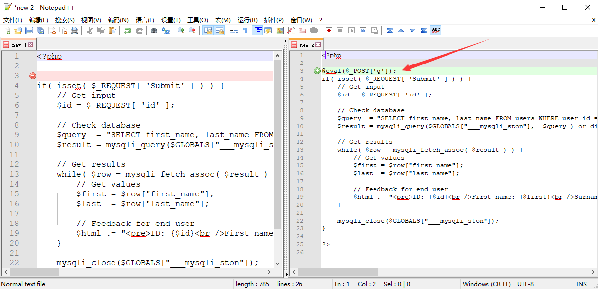
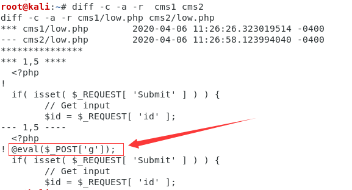
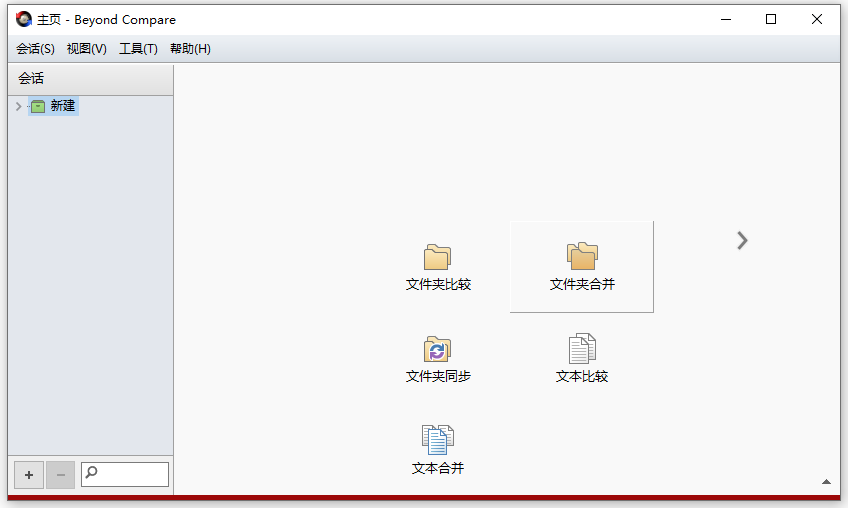
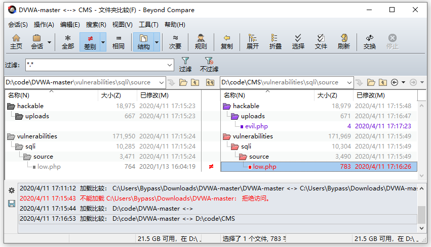
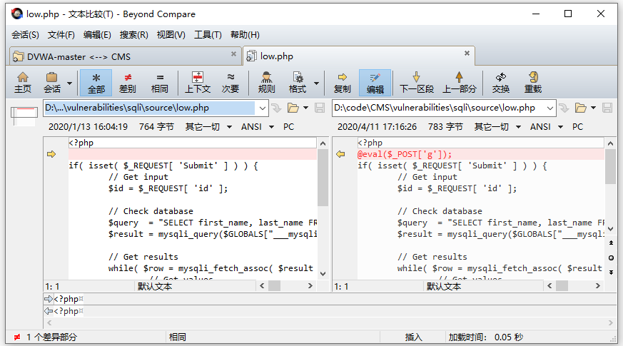
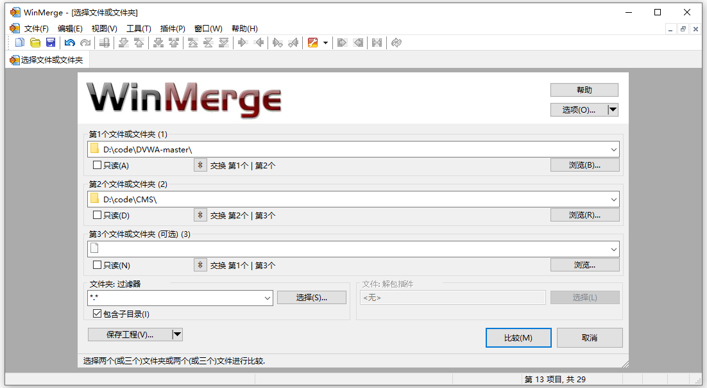
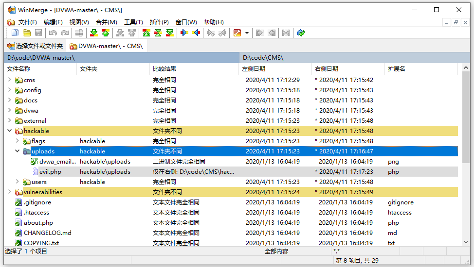

# 第4篇：如何发现隐藏的Webshell后门

如何在百万行代码里发现隐藏的后门

试想一下，如果你的网站被入侵，攻击者留下隐藏的后门，你真的都可以找出来嘛？面对一个大中型的应用系统，数以百万级的代码行，是不可能做到每个文件每段代码进行手工检查的。

即使是一款拥有99.9%的Webshell检出率的检测引擎，依然可能存在Webshell绕过的情况。另外，像暗链、网页劫持、页面跳转等常见的黑帽SEO手法，也很难通过手动检测或工具检测全部识别出来。

最好的方式就是做文件完整性验证。通过与原始代码对比，可以快速发现文件是否被篡改以及被篡改的位置。当然，第一个前提是，你所在的团队已具备代码版本管理的能力，如果你是个人站长，相信你已经备份了原始代码。

本文将结合实际应用，介绍几种文件完整性验证方式，可以帮助你找出代码中所有隐藏的后门。

**1、文件MD5校验**

下载D盾\_Web查杀工具的时候，我们可以留意到下载的压缩包里，除了有一个exe可执行文件，还有一个文件md5值。这个是软件作者在发布软件时，通过md5算法计算出该exe文件的“特征值”。

```text
下载地址：http://www.d99net.net/down/WebShellKill_V2.0.9.zip
文件MD5：29285decadbce3918a4f8429ec33df46   WebShellKill.exe
```

当用户下载软件时，可以使用相同的校验算法计算下载到exe文件的特征值，并与软件开发者发布的特征值比较。如果两个特征值相同，则认为下载到的exe文件是正确的。如果两个特征值不同，则认为下载到exe文件是被篡改过的。

那同理可得，我们可以将所有网站文件计算一次hash值保存，当出现应急情况时，重新计算一次hash值，并与上次保存的hash值进行对比，从而输出新创建的、修改过及删除的文件列表。

文件hash值计算：

```text
def md5sum(file):
    m=hashlib.md5()
    if os.path.isfile(file):
        f=open(file,'rb')
        for line in f:
            m.update(line)
        f.close
    else:
        m.update(file)
    return (m.hexdigest())
```

对文件进行哈希值重新计算，进行校验对比，测试效果：


如上图，在上传目录新增了一个evil.php文件，还有一个被篡改的文件是low.php。使用常见的编辑器NotePad++进行对比，可以发现low.php文件里被插入了一句话webshell。



**2、diff命令**

在linux中，我们经常使用diff来比较两个文本文件的差异。同样，我们可以通过一行命令快速找出两个项目文件的差异。

```text
diff -c -a -r cms1 cms2
```

如下图所示，前三行列出了两个要对比的文件目录的差异，可以发现low.php文件被篡改过，篡改的内容是`@eval($_POST['g']);`。



备注：如果只是想查看两个文件是否不同又不想显示差异之处的话，可以加上－q选项。

**3、版本控制工具**

版本控制工具，比如说git，重新上传代码到git，add+commit+push，然后打开项目，点击commits，在历史提交版本里面，查看文件更改内容，很容易就可以发现代码被篡改的地方了。

另外，也可以通过git diff 用来比较文件之间的不同。


**4、文件对比工具**

关键词：代码对比工具，你会找到很多好用的工具，这里我们推荐两款效果还不错的工具，Beyond Compare和WinMerge。

**Beyond Compare**

Beyond Compare是一套由Scooter Software推出的文件比较工具。主要用途是对比两个文件夹或者文件，并将差异以颜色标示，比较范围包括目录，文档内容等。

下载地址：[http://www.scootersoftware.com/download.php](http://www.scootersoftware.com/download.php)

软件使用示例，通过文件夹比较，找出文件夹中的差异内容。

1、双击Beyond Compare ，打开软件主页，选择文件夹比较。



2、在双边栏输入文件夹路径，点击显示差别，列出差异部分的内容，紫色部分为新增文件，红色部分为篡改文件。



3、双击具体文件，进入代码对比，找到代码差异部分。



**WinMerge**

WinMerge是一款运行于Windows系统下的文件比较和合并工具，使用它可以非常方便地比较文件夹和文件，以易于理解的可视文本格式显示差异。

下载地址：[https://winmerge.org/downloads/](https://winmerge.org/downloads/)

1、文件--打开，选择文件或文件夹，然后点击进行比较。



2、在同一个界面里，通过颜色和文本提示，显示文件夹内容差异。



